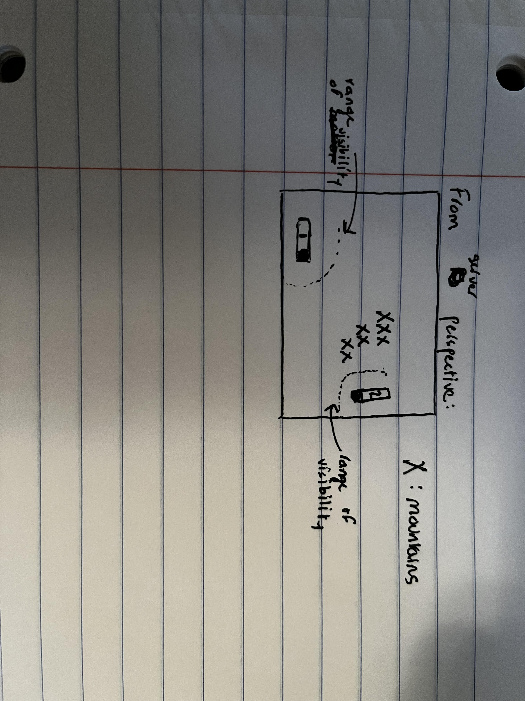

# (TODO: your game's title)

Author: Hridayesh Joshi

Design: This is a tactical dogfighting game in which the weather is terrible. The goal is for each player is to find the other, but not only that, you want to be oriented
behind the other player in order to shoot down their plane. What makes this game different is that you have limited vision so you have to find them first and you better
hope they are right behind you. There are mountains that you must avoid as well. The bad weather makes it impossible to fly through them. 

Networking: (TODO: How does your game implement client/server multiplayer? What messages are transmitted? Where in the code?)

Screen Shot:

How To Play:
The gameplay is not fully developed but this is what I had in mind for the controls:
W,A,S,D to move around and space to shoot. The goal is again to end up behind the other player, so you want to navigate the storm to best find them, but from behind them. If they are facing you, then they'll be able to shoot you down too. 

Sources: (TODO: list a source URL for any assets you did not create yourself. Make sure you have a license for the asset.)

This game was built with [NEST](NEST.md).

